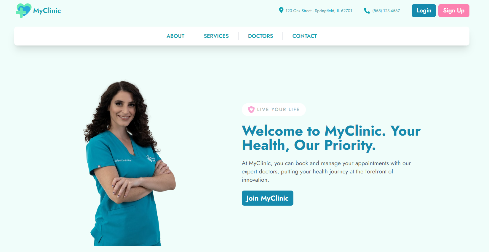
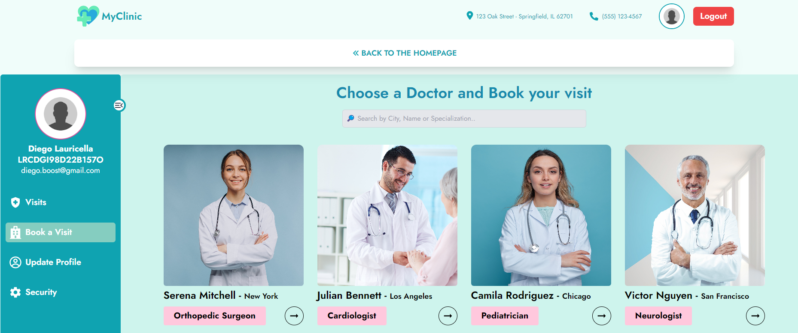
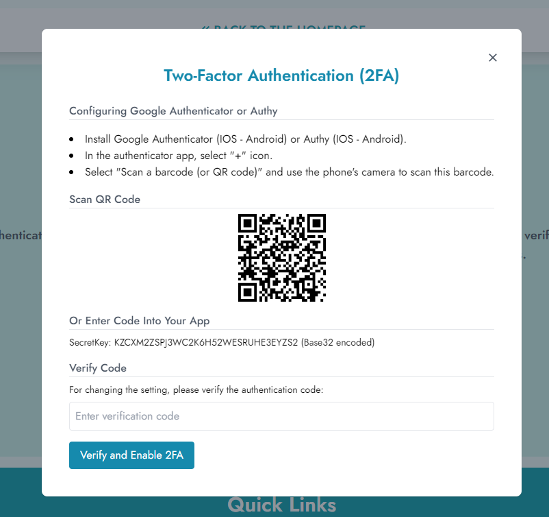

# WELCOME TO MYCLINIC! 🏥

This project is a Full Stack MERN application for a private clinic. It focuses on providing a secure and user-friendly interface for managing clinic operations. 
This is my final project for the Start2Impact's master in Full Stack Development.

I deployed the backend with Render and the frontend using Vercel. Additionally, the project is accessible at www.myclinic.tech, a domain purchased from Namecheap.

For further details please take a look at the presentation inside the repo.

Table of Contents 🔎
- [Introduction](#introduction)
- [Features](#features)
- [Tech Stack](#tech-stack)
- [Install Locally](#install-locally)
- [Api Endpoints](#api-endpoints)
- [Acknowledgements and Contacts](#acknowledgements-contacts)

## INTRODUCTION 🌎

MyClinic is a comprehensive solution designed for managing various aspects of a private clinic, from appointment scheduling to managing doctors' permissions and vacation days. It emphasizes security and user experience, ensuring that sensitive data is handled securely while offering an intuitive interface for both clinic staff and patients.

## FEATURES 🚀

- **User Authentication & 2FA**: The foremost priority is ensuring the security of user data and authentication mechanisms. When users register, they receive a confirmation email containing a unique link to verify their account, ensuring that only legitimate users gain access.
For login authentication, we utilize JSON Web Tokens (JWT) and Cookies, with JWTs expiring after 8 hours. This approach enhances security by limiting the duration of user sessions and mitigating the risk of unauthorized access. Additionally, users can opt to enable two-factor authentication (2FA), adding an extra layer of protection to their accounts. By requiring a secondary form of verification, such as a code sent to their mobile device, we further safeguard user accounts against potential threats.
- **Clarity and User Interface**: A clear and intuitive user interface is essential for both clinic staff and patients to efficiently navigate and utilize the application.
- **Appointment Booking & Dynamic Doctor Availability**: Patients can book appointments by viewing doctor availability in real-time. Upon booking, both the patient and doctor receive an automatic email summarizing the appointment details.
- **Leave Management**: Doctors can submit requests for leaves and permissions, which the admin can approve or decline.
- **Responsiveness**: The application is designed to be responsive, ensuring optimal user experience across devices of varying screen sizes, including desktops, tablets, and smartphones. This enhances accessibility and usability for all users, regardless of the device they are using.

These features represent just a glimpse of what our application offers. We invite you to explore the application firsthand to discover even more exciting functionalities and benefits it provides.

## TECH STACK ⛓️

### Backend
- **Node.js**: A runtime environment for executing JavaScript code on the server-side.
- **Express.js**: A web application framework for building robust and efficient web applications.
- **MongoDB**: A NoSQL database that stores data in flexible, JSON-like documents.
- **Mongoose**: A library for MongoDB and Node.js.
- **JSON Web Tokens(JWT)**: JWTs are commonly used for securely transmitting information between parties as a JSON object. They are often used for authentication and authorization in web applications.
- **Nodemailer**: A module for Node.js applications to allow easy email sending.

### Frontend
- **React**: A runtime environment for executing JavaScript code on the server-side.
- **Tailwind CSS**: A web application framework for building robust and efficient web applications.
- **Axios**: A promise-based HTTP client for the browser and Node.js. It simplifies the process of making asynchronous HTTP requests and handling responses in web applications.
- **React Icons**: A collection of popular icon libraries made available as React components.

## INSTALL LOCALLY ➡️
To get started with MyClinic locally, follow these steps:

1. Clone the Repo: `git clone https://github.com/diegoddie/S2I_FullStack_FinalProject_MERNclinic`
2. Install dependencies in both frontend and backend directories using npm install.
3. Configure your MongoDB Database: Go to https://www.mongodb.com/atlas/database and create a new free cluster DB.
4. Create a Cloudinary account.
4. Create a .env file in the backend directory and add the following variables:
    - MONGODB_URI
    - JWT_SECRET
    - RESET_SECRET
    - GMAIL 
    - ADMIN_EMAIL
    - GMAIL_PSW_APP
    - NODE_ENV (development or production)
    - CLOUD_NAME
    - CLOUDINARY_APY_KEY
    - CLOUDINARY_APY_SECRET
5. Create a .env file in the frontend directory and add the following variables:
    - NODE_ENV (development or production)
6. Start the backend server using npm start in the backend directory.
7. Start the frontend server using npm start in the frontend directory.
8. Access the application in your browser at http://localhost:3001.

## API ENDPOINTS 🧑🏻‍💻
Here are the available API endpoints that you can test using Postman:

### Auth API
- **POST /sign-up**: Sign up a new user. (**For patients only**)
- **POST /doctor/create**: Sign up a new doctor. (**For admin only**)
- **POST /request-new-verification-email**: Request a new verification email.
- **POST /user/sign-in**: Sign in an existing user/admin. 
- **POST /doctor/sign-in**: Sign in an existing doctor. 
- **POST /user/verify-password**: Verify user's password.
- **POST /doctor/verify-password**: Verify doctor's password.
- **POST /user/password-reset-request**: Request a password reset for a user/admin.
- **POST /doctor/password-reset-request**: Request a password reset for a doctor.
- **POST /user/password-reset/:token**: Reset the password for a user/admin using the provided token.
- **POST /doctor/password-reset/:token**: Reset the password for a doctor using the provided token.
- **POST /user/generate2FA/:id**: Generate a two-factor authentication for a user/admin. 
- **POST /doctor/generate2FA/:id**: Generate a two-factor authentication for a doctor.
- **POST /user/verify2FA/:id**: Verify a two-factor authentication for a user/admin.
- **POST /doctor/verify2FA/:id**: Verify a two-factor authentication for a doctor. 
- **POST /user/disable2FA/:id**: Disable two-factor authentication for a user/admin.
- **POST /doctor/disable2FA/:id**: Disable two-factor authentication for a doctor.

- **GET /sign-out**: Sign out the current user.
- **GET /user/verify-email/:token**: Verify the user's email address using the provided token. 
- **GET /doctor/verify-email/:token**: Verify the doctor's email address using the provided token.

### Patients API
- **PUT /user/update/:id**: Update user/admin information.

- **DEL /user/delete/:id**: Delete a user/admin.

- **GET /user/profile/:id**: Get the profile of a specific user/admin.
- **GET /user**: Get all users (**For admin only**)

### Doctors API
- **PUT /doctor/update/:id**: Update doctor's information.
- **PUT /doctor/:doctorId/approve/:requestId**: Approve a leave request for a doctor (**For admin only**)
- **PUT /doctor/:doctorId/decline/:requestId**: Decline a leave request for a doctor (**For admin only**)

- **DEL /doctor/delete/:id**: Delete a doctor (**For doctor and Admin**)
- **DEL /doctor/:doctorId/leave-requests/:requestId**: Delete a specific leave request.

- **GET /doctor/:id**: Get details of a specific doctor.
- **GET /doctor/profile/:id**: Get the profile of the authenticated doctor. (**For doctor only**)
- **GET /doctor**: Get all doctors (**For admin only**)
- **GET /doctor/:id/weeklyAvailability**: Get the weekly availability schedule of a specific doctor. 

### Visits API
- **POST /visit/create**: Create a new visit. (**For Patients and Admin only**)

- **PUT /visit/update/:id**: Update visit data.

- **DEL /visit/delete/:id**: Delete a visit.

- **GET /visit**: Get details of all visits. (**For admin only**)
- **GET /visit/:id**: Get details of a specific visit.
- **GET /visit/doctor/:doctorId**: Get details of visits associated with a specific doctor.
- **GET /visit/user/:user**: Get details of visits associated with a specific user.
- **GET /visit/pending-payments**: Get details of visits with pending payments. (**For admin only**)

## ACKNOWLEDGEMENTS AND CONTACTS ✉️
This project marks the culmination of my journey in the Start2Impact's master program in Full Stack Development. It has been an immensely educational and stimulating experience, allowing me to connect with many individuals and foster a deep passion for programming.

If you have any questions, feedback, or just want to connect, feel free to reach out to me through the following channels:

- Email: diego.boost@gmail.com
- Personal Website: https://diego-lauricella.netlify.app
- Twitter: https://twitter.com/diegothedev
- Github: https://github.com/diegoddie
- Fiverr: https://www.fiverr.com/diegoddie
- Upwork: https://www.upwork.com/freelancers/~01021369935709b658